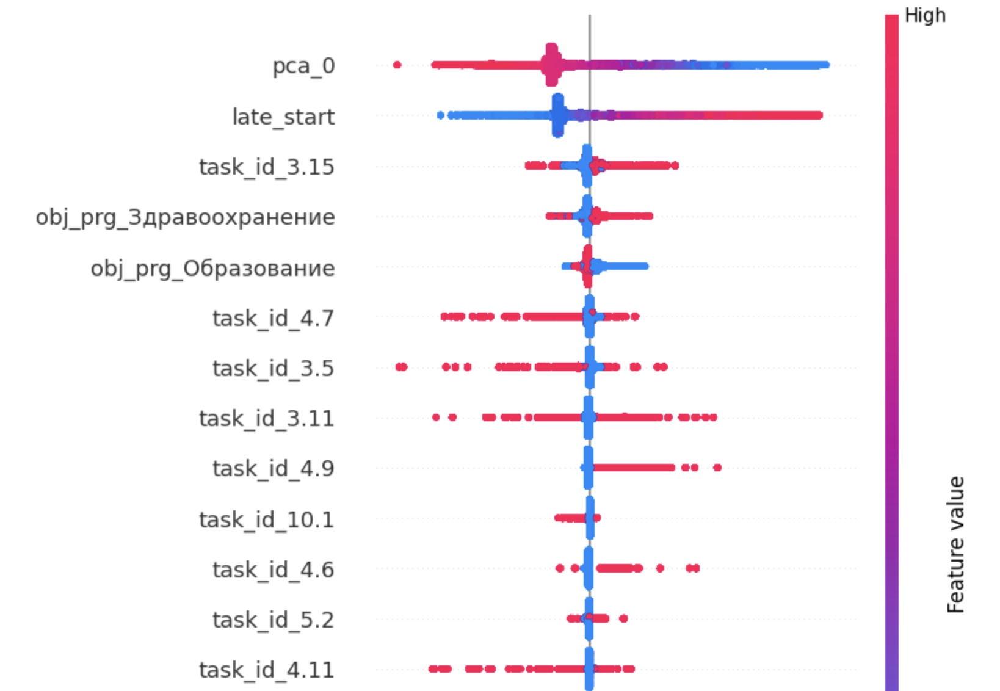
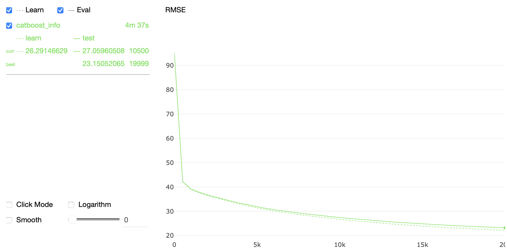
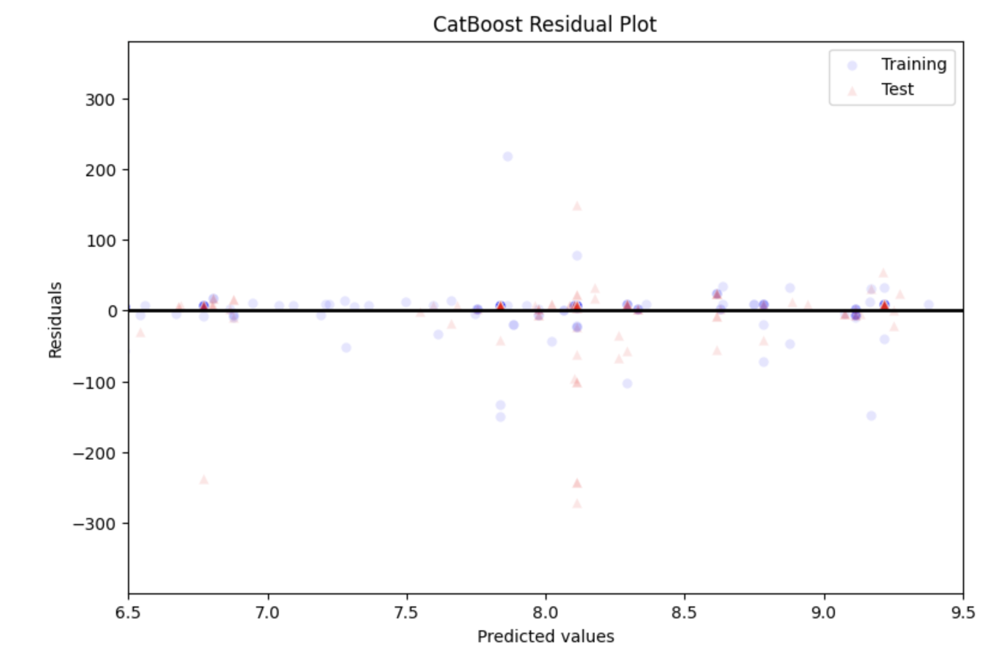
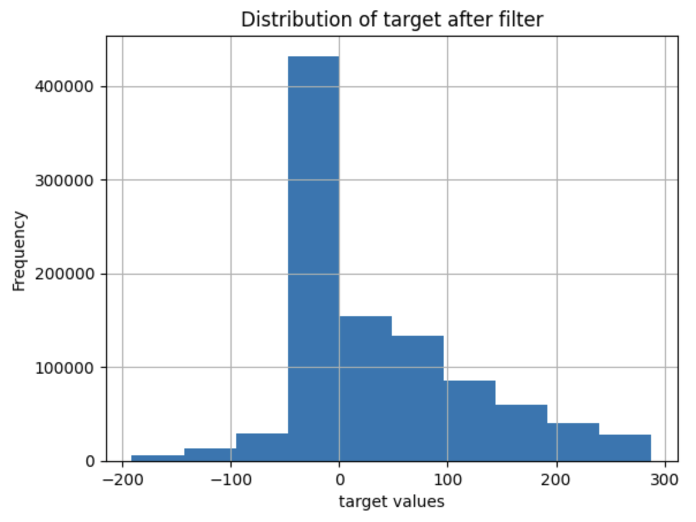

#### Если вдруг будет интересно что подробно происходит с данными в репозитории есть `pipeline_notebook.ipynb`


## Описание ML сервиса

Так как задача прогнозирования задержки срока выполнения критических задач и всего проекта складывается из агрегации оценок задержки задач (что достаточно очевидно), был сформирован таргет и поставлена задача для машинного обучения: "Регрессирование задержки выполнения работ по задаче (в днях)"

Зачем придумывать велосипед, когда есть патриотический мотоцикл :) поэтому `CatBoostRegressor`!

Итак стек ml решения: `python3.11` `catboost` `sklearn` `fpgrowth` `shap`

## Фичи

Как и в любой табличной задаче очень важен процесс инженеринга фичей, потому что-то было получено эмперическим путем, что-то является очевидным информативным признаком, а для что-то найти не так просто и именно для этого был использован `fpgrowth`.



## Обучение

В такой задаче главное недопустить лик данных, так как на таких обьемах это может притически сказаться на качестве в продакшене.

Для обучения конечно же были выбраны оптимальные параметры библиотеки, благо сейчас `catboost` в этом плане является максимально удобной библиотекой, так как вокруг обучения модели за время существования библиотеки выстроено много удобных конвееров.



## Валидация результатов



Полученные метрики на тестовом срезе данных:

```mean_squared_error: 23.1```

```mean_absolute_error: 3.3```

На кастомные более информативные метрики немного не хватило времени, но в целом средняя абсолютная ошибка достаточно информативный показатель в данной задаче. Значение данной метрики отлично интерпретируется - в среднем предсказывая задержку задачи мы ошибоемся на 3 дня. Что конечно является хорошим результатом, так как распределение задержек по датасету в целом имеет вид:


